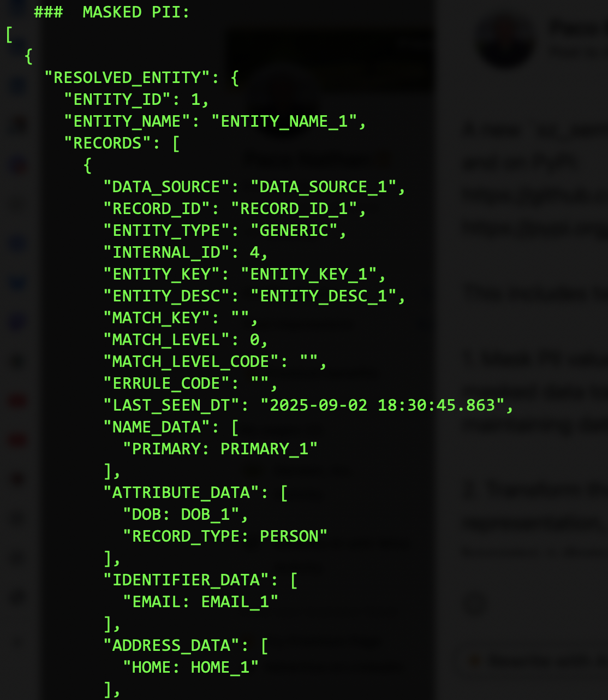

# sz_semantics

Transform JSON output from the [Senzing SDK](https://senzing.com/docs/python/)
for use with graph technologies, semantics, and downstream LLM integration.


## Install

This library uses [`poetry`](https://python-poetry.org/docs/) for
demos:

```bash
poetry update
```

Otherwise, to use the library:

```bash
pip install sz_sematics
```

For the [gRCP server](https://github.com/senzing-garage/serve-grpc), 
if you don't already have Senzing and its gRPC server otherwise
installed pull the latest Docker container:

```bash
docker pull senzing/serve-grpc:latest
```


## Usage: Masking PII

Mask the PII values within Senzing JSON output with tokens which can
be substituted back later. For example, _mask_ PII values before
calling a remote service (such as an LLM-based chat) then _unmask_
returned text after the roundtrip, to maintain _data privacy_.

```python
import json
from sz_semantics import Mask

data: dict = { "ENTITY_NAME": "Robert Smith" }

sz_mask: Mask = Mask()
masked_data: dict = sz_mask.mask_data(data)

masked_text: str = json.dumps(masked_data)
print(masked_text)

unmasked: str = sz_mask.unmask_text(masked_text)
print(unmasked)
```

For an example, run the `demo1.py` script with a data file which
captures Senzing JSON output:

```bash
poetry run python3 demo1.py data/get.json
```

The two lists `Mask.KNOWN_KEYS` and `Mask.MASKED_KEYS` enumerate
respectively the:

  * keys for known elements which do not require masking
  * keys for PII elements which require masking

Any other keys encountered will be masked by default and reported as
warnings in the logging. Adjust these lists as needed for a given use
case.

For work with large numbers of entities, subclass `KeyValueStore` to
provide a distributed key/value store (other than the Python built-in
`dict` default) to use for scale-out.


## Usage: gRPC Client/Server

To use `SzClient` to simplify access to the Senzing SDK, first launch
the `serve-grpc` container and run it in the background:

```bash
docker run -it --publish 8261:8261 --rm senzing/serve-grpc
```

For example code which runs _entity resolution_ on the "truthset"
collection of datasets:

```python
import pathlib
import tomllib
from sz_semantics import SzClient

with open(pathlib.Path("config.toml"), mode = "rb") as fp:
    config: dict = tomllib.load(fp)

data_sources: typing.Dict[ str, str ] = {
    "CUSTOMERS": "data/truth/customers.json",
    "WATCHLIST": "data/truth/watchlist.json",
    "REFERENCE": "data/truth/reference.json",
}

sz: SzClient = SzClient(config, data_sources)
sz.entity_resolution(data_sources)

for ent_json in sz.sz_engine.export_json_entity_report_iterator():
    print(ent_json)
```

For a demo of running entity resolution on the "truthset", run the
`demo2.py` script:

```bash
poetry run python3 demo2.py
```

This produces the `export.json` file which is JSONL representing the
results of a "get entity" call on each resolved entity.

Note: to show the redo processing, be sure to restart the container
each time before re-running the `demo2.py` script -- although the
entity resolution results will be the same even without a container
restart.


## Usage: Semantic Represenation

Starting with a small [SKOS-based taxonomy](https://www.w3.org/2004/02/skos/)
in the `domain.ttl` file, parse the Senzing
[_entity resolution_](https://senzing.com/what-is-entity-resolution/)
(ER) results to generate an 
[`RDFlib`](https://rdflib.readthedocs.io/) _semantic graph_.

In other words, generate the "backbone" for constructing an
[_Entity Resolved Knowledge Graph_](https://senzing.com/entity-resolved-knowledge-graphs/),
as a core componet of a
[_semantic layer_](https://enterprise-knowledge.com/what-is-a-semantic-layer-components-and-enterprise-applications/).

The example code below serializes the _thesaurus_ generated from
Senzing ER results as `"thesaurus.ttl"` combined with the Senzing
_taxonomy_ definitions, which can be used for constructing knowledge
graphs:

```python
import pathlib
from sz_semantics import Thesaurus

thesaurus: Thesaurus = Thesaurus()
thesaurus.load_source(Thesaurus.DOMAIN_TTL)

export_path: pathlib.Path = pathlib.Path("data/truth/export.json")

with open(export_path, "r", encoding = "utf-8") as fp_json:
    for line in fp_json:
        for rdf_frag in thesaurus.parse_iter(line, language = "en"):
            thesaurus.load_source_text(
                Thesaurus.RDF_PREAMBLE + rdf_frag,
                format = "turtle",
            )

thesaurus_path: pathlib.Path = pathlib.Path("thesaurus.ttl")
thesaurus.save_source(thesaurus_path, format = "turtle")
```

For an example, run the `demo3.py` script to process the JSON file
`data/truth/export.json` which captures Senzing ER exported results:

```bash
poetry run python3 demo3.py data/truth/export.json
```

Check the resulting RDF definitions in the generated `thesaurus.ttl`
file.


---



---

<details>
  <summary>License and Copyright</summary>

Source code for `sz_semantics` plus any logo, documentation, and
examples have an [MIT license](https://spdx.org/licenses/MIT.html)
which is succinct and simplifies use in commercial applications.

All materials herein are Copyright © 2025 Senzing, Inc.
</details>

Kudos to 
[@brianmacy](https://github.com/brianmacy),
[@jbutcher21](https://github.com/jbutcher21),
[@docktermj](https://github.com/docktermj),
[@cj2001](https://github.com/cj2001),
[@jesstalisman-ia](https://github.com/jesstalisman-ia),
and the kind folks at [GraphGeeks](https://graphgeeks.org/) for their support.
</details>


## Star History

[](https://star-history.com/#senzing-garage/sz-semantics&Date)
